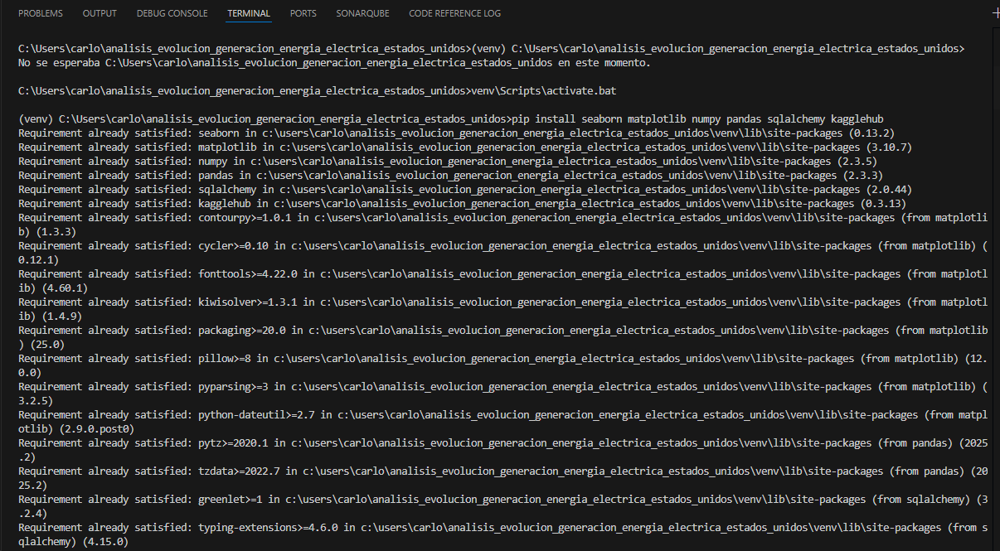
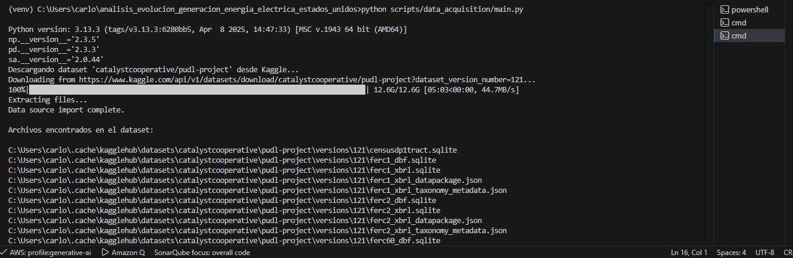
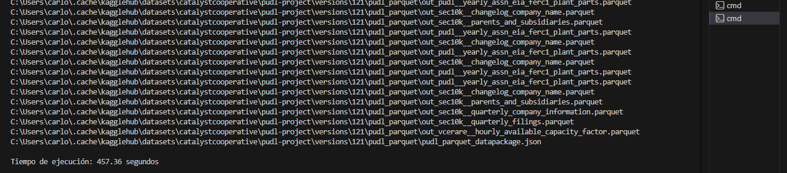
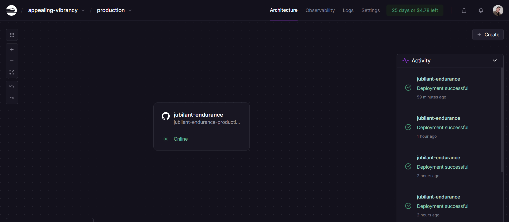
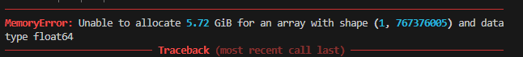
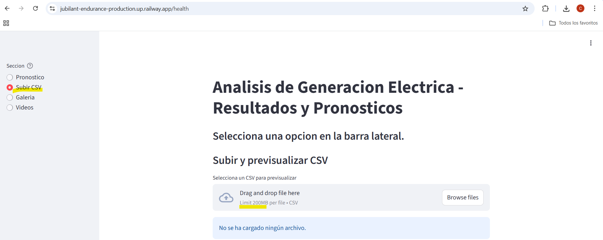

# Informe de salida

## Resumen Ejecutivo

Este proyecto aborda la creciente preocupación por el cambio climático y la dependencia de los combustibles fósiles para la generación de energía eléctrica. Dada la necesidad de migrar hacia tecnologías más limpias y con bajas emisiones de carbono, el objetivo principal es analizar la evolución de las tecnologías de generación de energía renovable (hidroeléctrica, eólica, solar) en comparación con las fuentes convencionales (termoeléctricas) en Estados Unidos, abarcando el período entre 2001 y 2022.

Contexto y Problema: La generación de energía eléctrica es una de las principales fuentes de emisiones de CO2. Aunque tecnologías limpias como la hidroeléctrica, nuclear, eólica y solar están avanzando, su implementación a gran escala enfrenta desafíos tecnológicos y económicos. La analítica de datos se presenta como una herramienta clave para la optimización del mercado eléctrico, el pronóstico de la demanda y la gestión de redes inteligentes.

En resumen, el proyecto busca ofrecer un análisis descriptivo y comparativo robusto para entender las dinámicas y la viabilidad futura de la transición hacia una matriz energética más sostenible en Estados Unidos.

## Resultados del proyecto - Entrega 1

- Se adjunta evidencias de adquisición y carga de datos desde KaggleHub:

- Se adjunta evidencia Kaggle :

- Reporte tiempo de ejecucion: 

## Despliegue

- Comando de arranque: uvicorn scripts.app.main:app --host 0.0.0.0 --port ${PORT} (FastAPI). Como actualmente se emplea Streamlit, se hizo: run scripts/app_streamlit.py --server.port $PORT --server.address 0.0.0.0.
- Comando Build: En Railway se usa el del documento requirements con pip install -r requirements.txt para instalar deps (FastAPI, uvicorn, pandas, scikit-learn, streamlit, etc.).
- Datos: incluimos docs/data/comanche_ferc1_annual.csv en el repo como muestra; no usamos volumen ni descarga de la BD de 14 GB. Para datos subidos en runtime, la app Streamlit tiene uploader.
- Rutas FastAPI: /health, /sample, /forecast.
- Streamlit: sidebar con secciones Pronóstico, Subir CSV, Galería (imágenes en docs/data o IMG_PATH), Videos (MP4 en VIDEO_PATH o base).
- Variables de entorno: PORT la cual configura Railway; opcionales PUDL_PATH, IMG_PATH, VIDEO_PATH para rutas.
- URL servicio Streamlit:
    - https://jubilant-endurance-production.up.railway.app/health
- Evidencia:

## Lecciones aprendidas - Por definir

- Se intentó realizar un análisis y pronóstico a nivel de condado, pero se presentó un error de memoria insuficiente: el código intentó reservar aproximadamente 5.7 GB de RAM para un arreglo float64 de forma (1, 767,376,005). Con la RAM disponible en Railway (1 GB) no es posible completar esa operación. Esto sugiere que el CSV subido es demasiado grande o que, al transformar/convertir columnas, se está generando un arreglo enorme en memoria.
- 
- La base de datos utilizada supera los 12 GB, por lo cual se planteó como alternativa subir CSVs desde Streamlit y realizar el análisis de forma individual por planta (por ejemplo, Comanche). Debido a esta limitación, se brinda al usuario final la opción de seleccionar el modelo con el que desea realizar el análisis.
-

## Impacto del proyecto - Por definir

- Descripción del impacto del modelo en el negocio o en la industria.
- Identificación de las áreas de mejora y oportunidades de desarrollo futuras.

## Conclusiones - Por definir

- Resumen de los resultados y principales logros del proyecto.
- Conclusiones finales y recomendaciones para futuros proyectos.

## Agradecimientos - Por definir

- Agradecimientos al equipo de trabajo y a los colaboradores que hicieron posible este proyecto.
- Agradecimientos especiales a los patrocinadores y financiadores del proyecto.

