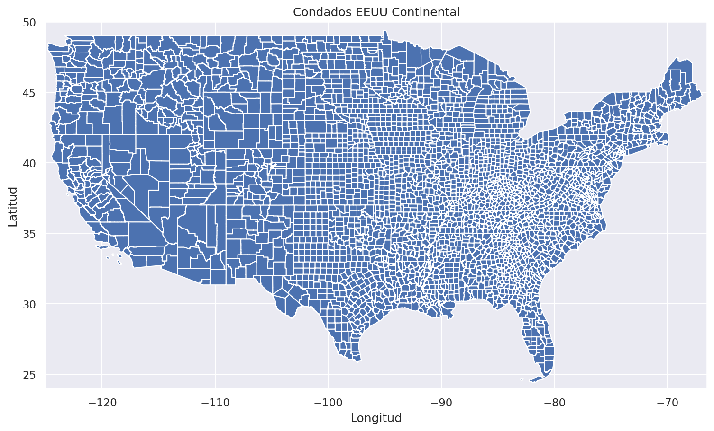
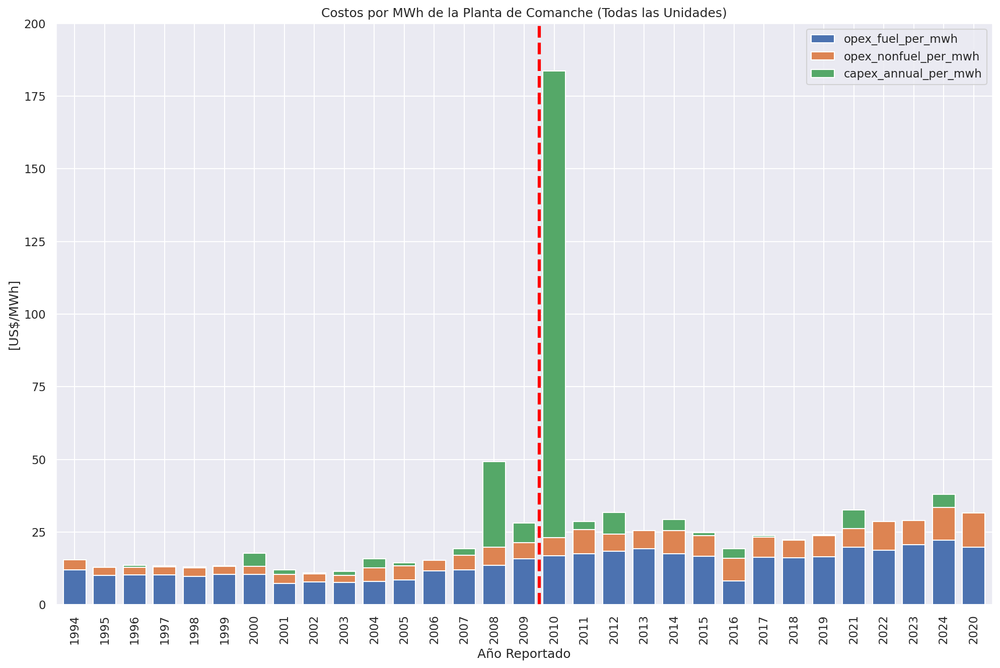
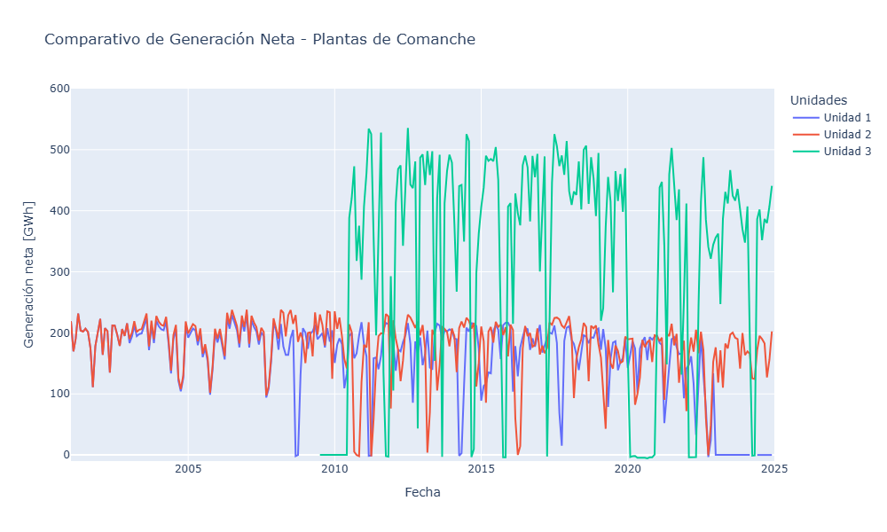
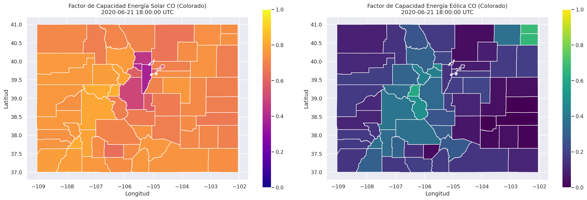
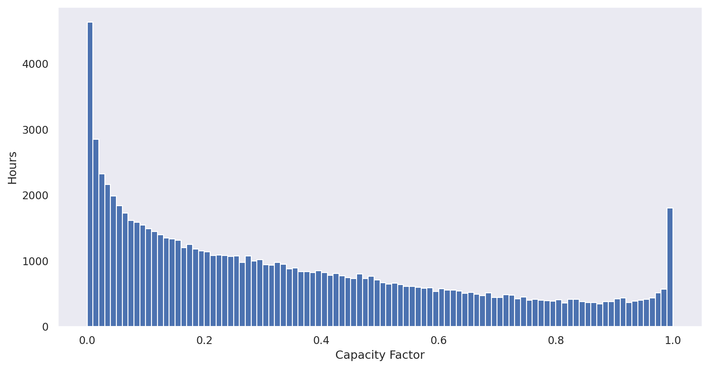
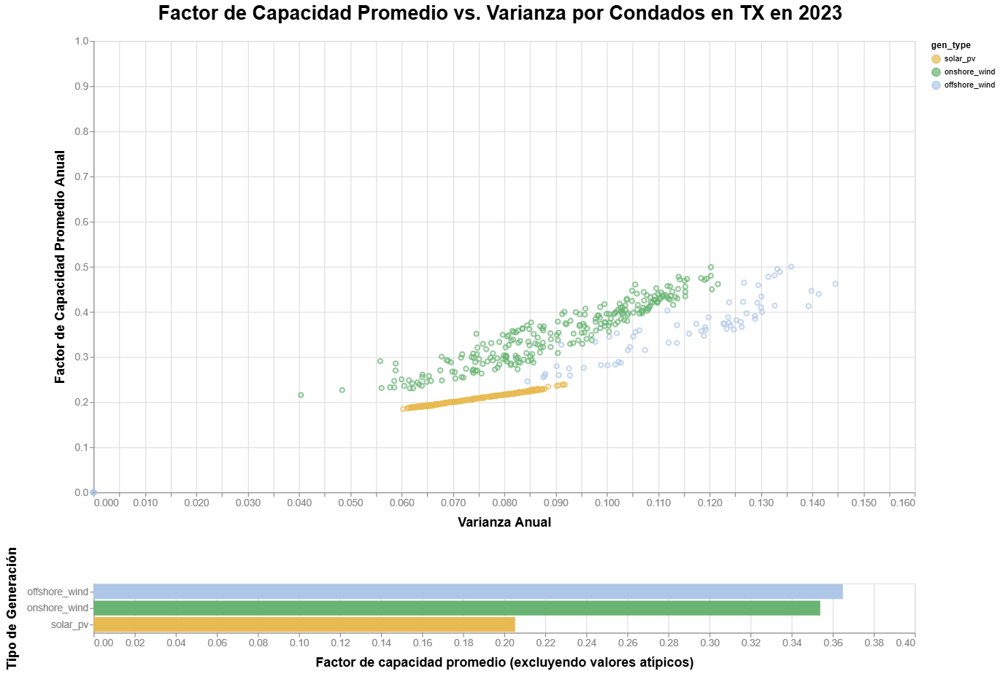

# Reporte de Datos

Inicialmente, se llevara a cabo la carga de la base de datos y las librerías que no serán más útiles para su manipulación y posterior análisis mediante estadísitica descriptiva e inferencial.

Para realizar una primera exploración de la base de datos, realizaremos la búsqueda y análisis de datos de producción, consumo, costos, entre otros de la operación de Planta de Generación de Energía Eléctrica "Comanche" ubicada, ubicada en el Estado de Colorado, la cual genera energía mediante vapor calentado mediante que de Carbón (Termoeléctrica) y más recientemente Energía Solar Fotovoltaica; teniendo una capacidad neta instalada de 1252 Megavatios (MW).

En los siguientes fragmentos de código se realiza la conexión de la copia de la base de datos previamente creada con las librerías de SQL Alchemy, con la finalidad de realizar la búsqueda y filtración de los datasets que contienen la información deseada sobre la planta de Comanche.

Luego se analizará en mayor detalle el conjunto de datos RARE, vcerare en PUDL, que fue generado por la compañía Vibrant Clean Energy y consta de perfiles horarios de generación renovable por condado para energía solar fotovoltaica, eólica terrestre y eólica marina en Estados Unidos continental. Se generó utilizando los resultados del modelo meteorológico de actualización rápida de alta resolución (HRRR) de la NOAA. Visite nuestra página de fuentes de datos de VCE para obtener más información. VCE publica estos datos bajo la licencia de atribución CC-BY-4.0.

## Resumen general de los datos

# Análisis Exploratorio Operación y Generación Planta Comanche

Para la tabla que contiene los datos de generación y operación de la planta de Comanche, obtuvimos el siguiente resumen de datos:

<class 'pandas.core.frame.DataFrame'>
RangeIndex: 34111 entries, 0 to 34110
Data columns (total 55 columns):
 #   Column                                  Non-Null Count  Dtype  
---  ------                                  --------------  -----  
 0   report_year                             34111 non-null  Int64  
 1   utility_id_ferc1                        34111 non-null  Int64  
 2   utility_id_pudl                         34111 non-null  Int64  
 3   utility_name_ferc1                      34111 non-null  string 
 4   plant_id_pudl                           34111 non-null  Int64  
 5   plant_id_ferc1                          34111 non-null  Int64  
 6   plant_name_ferc1                        34111 non-null  string 
 7   asset_retirement_cost                   10663 non-null  float64
 8   avg_num_employees                       20328 non-null  Int64  
 9   capacity_factor                         31352 non-null  float64
 10  capacity_mw                             33489 non-null  float64
 11  capex_annual_addition                   29525 non-null  float64
 12  capex_annual_addition_rolling           22970 non-null  float64
 13  capex_annual_per_kw                     28400 non-null  float64
 14  capex_annual_per_mw                     28400 non-null  float64
 15  capex_annual_per_mw_rolling             22463 non-null  float64
 16  capex_annual_per_mwh                    27345 non-null  float64
 17  capex_annual_per_mwh_rolling            21726 non-null  float64
 18  capex_equipment                         31196 non-null  float64
 19  capex_land                              24295 non-null  float64
 20  capex_per_mw                            33266 non-null  float64
 21  capex_structures                        30269 non-null  float64
 22  capex_total                             31563 non-null  float64
 23  capex_wo_retirement_total               34111 non-null  float64
 24  construction_type                       28836 non-null  string 
 25  construction_year                       32473 non-null  Int64  
 26  installation_year                       32227 non-null  Int64  
 27  net_generation_mwh                      31416 non-null  float64
 28  not_water_limited_capacity_mw           24799 non-null  float64
 29  opex_allowances                         6307 non-null   float64
 30  opex_boiler                             19200 non-null  float64
 31  opex_coolants                           2876 non-null   Int64  
 32  opex_electric                           25529 non-null  float64
 33  opex_engineering                        26338 non-null  float64
 34  opex_fuel                               30124 non-null  float64
 35  opex_fuel_per_mwh                       28864 non-null  float64
 36  opex_misc_power                         26755 non-null  float64
 37  opex_misc_steam                         25165 non-null  Int64  
 38  opex_nonfuel_per_mwh                    29157 non-null  float64
 39  opex_operations                         27218 non-null  float64
 40  opex_per_mwh                            33023 non-null  float64
 41  opex_plants                             30333 non-null  float64
 42  opex_production_total                   32262 non-null  float64
 43  opex_rents                              11603 non-null  float64
 44  opex_steam                              20570 non-null  float64
 45  opex_steam_other                        1600 non-null   Int64  
 46  opex_structures                         27121 non-null  float64
 47  opex_total_nonfuel                      32262 non-null  float64
 48  opex_transfer                           1487 non-null   float64
 49  peak_demand_mw                          28056 non-null  float64
 50  plant_capability_mw                     9640 non-null   float64
 51  plant_hours_connected_while_generating  28979 non-null  Int64  
 52  plant_type                              32695 non-null  string 
 53  record_id                               34111 non-null  string 
 54  water_limited_capacity_mw               19292 non-null  float64
dtypes: Int64(12), float64(38), string(5)
memory usage: 14.7 MB
CPU times: user 1.68 s, sys: 45.3 ms, total: 1.73 s
Wall time: 1.83 s
/usr/local/lib/python3.11/dist-packages/pandas/core/dtypes/cast.py:1057: RuntimeWarning: invalid value encountered in cast
  if (arr.astype(int) == arr).all():

Se puede observar un mayor detalle de los datos tratados con la siguiente muestra:

          plant_id_eia  plant_id_pudl  plant_name_eia                 utility_name_eia       city state   latitude   longitude
51929          59656           8375  Comanche Solar                   Novatus Energy     Pueblo    CO  38.205276 -104.566704
51936          59656           8375  Comanche Solar                     Comanche LLC     Pueblo    CO  38.205276 -104.566704
151366          8059            127        Comanche    Public Service Co of Oklahoma     Lawton    OK  34.543098  -98.324402
168302          6145           2514   Comanche Peak  Luminant Generation Company LLC  Glen Rose    TX  32.298367  -97.785522
168317          6145           2514   Comanche Peak             TXU Generation Co LP  Glen Rose    TX  32.298367  -97.785522
214599           470            126        Comanche    Public Service Co of Colorado     Pueblo    CO  38.208099 -104.574699

Esta tabla contiene la información de gran parte de las plantas de generación eléctrica de Estados Unidos, por lo cual para realizar el análisis exploratorio de la planta Comnache, se llevó acabo el respectivo filtro como se muestra a continuación:

Datos filtrados para la planta Comanche (plant_id_pudl = 126):

       report_year  plant_id_ferc1 plant_name_ferc1  plant_id_pudl  ...  opex_per_mwh  opex_nonfuel_per_mwh  opex_fuel_per_mwh  report_date
17051         1994            2803         comanche            126  ...     15.500000              3.553582          11.928412   1994-01-01
17052         1995            2803         comanche            126  ...     12.800000              2.810450          10.066210   1995-01-01
17053         1996            2803         comanche            126  ...     12.900000              2.649606          10.263458   1996-01-01
17054         1997            2803         comanche            126  ...     13.000000              2.756338          10.301495   1997-01-01
17055         1998            2803         comanche            126  ...     12.800000              2.958946           9.818877   1998-01-01
17056         1999            2803         comanche            126  ...     13.300000              2.842295          10.454893   1999-01-01
17057         2000            2803         comanche            126  ...     13.200000              2.765990          10.463732   2000-01-01
17058         2001            2803         comanche            126  ...     10.500000              3.202606           7.255589   2001-01-01
17059         2002            2803         comanche            126  ...     10.500000              2.668624           7.874949   2002-01-01
17060         2003            2803         comanche            126  ...     10.100000              2.485490           7.653125   2003-01-01
17061         2004            2803         comanche            126  ...     12.700000              4.647251           8.045838   2004-01-01
17062         2005            2803         comanche            126  ...     13.500000              4.842974           8.610705   2005-01-01
17063         2006            2803         comanche            126  ...     15.200000              3.609286          11.635755   2006-01-01
17064         2007            2803         comanche            126  ...     17.000000              5.072234          11.948965   2007-01-01
17065         2008            2803         comanche            126  ...     19.799999              6.193454          13.574260   2008-01-01
17066         2009            2803         comanche            126  ...     21.299999              5.589444          15.747905   2009-01-01
17067         2010            2803         comanche            126  ...     23.200001              6.307078          16.860746   2010-01-01
17068         2011            2803         comanche            126  ...     25.799999              8.253447          17.569845   2011-01-01
17069         2012            2803         comanche            126  ...     24.299999              5.897953          18.366215   2012-01-01
17070         2013            2803         comanche            126  ...     25.500000              6.154033          19.302310   2013-01-01
17071         2014            2803         comanche            126  ...     25.600000              8.083256          17.494916   2014-01-01
17072         2015            2803         comanche            126  ...     23.799999              7.074131          16.685878   2015-01-01
17073         2016            2803         comanche            126  ...     15.900000              7.658652           8.283606   2016-01-01
17074         2017            2803         comanche            126  ...     23.299999              6.999481          16.271607   2017-01-01
17075         2018            2803         comanche            126  ...     22.299999              6.127648          16.160212   2018-01-01
17076         2019            2803         comanche            126  ...     23.799999              7.244897          16.579611   2019-01-01
17077         2021            2803         comanche            126  ...     26.299999              6.483587          19.792383   2021-01-01
17078         2022            2803         comanche            126  ...     28.700001              9.851774          18.838951   2022-01-01
17079         2023            2803         comanche            126  ...     29.000000              8.378960          20.609569   2023-01-01
17080         2024            2803         comanche            126  ...     33.500000             11.372652          22.152953   2024-01-01
17220         2020            4404         comanche            126  ...     31.600000             11.812938          19.755095   2020-01-01

# Análisis Potencial de Generación de Energía Eléctrica y Solar en Estados Unidos:

Uso del conjunto de datos de energía renovable de adecuación de recursos (RARE) de VCE: El conjunto de datos RARE, vcerare en PUDL, fue generado por Vibrant Clean Energy y consta de perfiles horarios de generación renovable por condado para energía solar fotovoltaica, eólica terrestre y eólica marina en Estados Unidos continental. Se generó utilizando los resultados del modelo meteorológico de actualización rápida de alta resolución (HRRR) de la NOAA. Visite nuestra página de fuentes de datos de VCE para obtener más información. VCE publica estos datos bajo la licencia de atribución CC-BY-4.0.

Acceso a VCE RARE mediante CSV o Parquet Los datos de VCE RARE se distribuyen en dos formatos:

Archivos CSV sin procesar (Zenodo)
Archivos PUDL Parquet procesados (Kaggle, AWS S3, Zenodo)
Archivos CSV sin procesar (Zenodo): Los datos sin procesar se organizan en varios archivos CSV. Cada uno contiene un año para los datos de un tipo de generación (solar fotovoltaica, eólica terrestre, eólica marina), una columna de índice para la hora del año (1-8760) y una columna para cada uno de los aproximadamente 3000 condados que contienen el factor de capacidad modelado. Este formato está optimizado para su uso en Excel y limita el número de filas y columnas para que Excel pueda gestionarlo. Consulte el archivo README en el archivo de Zenodo para obtener más detalles sobre los datos sin procesar.

*Archivos PUDL Parquet procesados (Kaggle, AWS S3, versiones de PUDL con versiones en Zenodo): *Los datos procesados se publican como un único archivo Apache Parquet. Parquet es un formato de archivo abierto diseñado para realizar análisis con conjuntos de datos más grandes. Los datos procesados se han rediseñado a partir del formato ancho original para utilizar un formato de datos ordenado. El condado se integra en su propia columna en lugar de ser un encabezado de columna.

Se han añadido columnas adicionales para facilitar la selección de datos y permitir su uso en combinación con otros conjuntos de datos.

Latitud
Longitud
Código FIPS del condado
Año del informe
Marca de tiempo (UTC)
Campos separados para el nombre del estado y el condado (los encabezados de columna de datos sin procesar tienen el formato County_Name_State_Name).
Consulte nuestro diccionario de datos para obtener más información sobre el esquema de la tabla procesada.

¿Cuál debería usar?

Si desea o necesita modificar el diseño de los datos para incorporarlos a su modelo, le interesa un subconjunto específico de datos, desea conectarlos a datos geoespaciales o desea ver o ejecutar análisis de todos los datos a la vez, ¡los archivos PUDL Parquet procesados son la solución ideal! Para contextualizar, el límite de filas en Excel es de poco más de un millón. La tabla PUDL procesada contiene 136 437 000 filas. A continuación, le mostraremos cómo gestionar este conjunto de datos sin sobrecargar su ordenador.

Si trabaja con Excel o si los datos de formato ancho 8760 tienen la forma exacta que necesita para el modelado, puede que prefiera usar los archivos CSV sin procesar.

Este cuaderno también incluye ejemplos de cómo seleccionar y descargar un subconjunto de los datos Parquet como CSV.

## Resumen de calidad de los datos

# Análisis Exploratorio Operación y Generación Planta Comanche

Como se puede observar en el resumen de la tabla de datos para la planta Comanche, no exiten valores nulos ni anómalos en el conjunto de datos explorado, lo anterior se debe a que los datos generados fueron posteriormente tratados por los administradores de la base de datos PUDL en donde se recopila toda está información, la cual es actualizada constantemente por los analistas de datos que colaboran con esta iniciativa.

# Análisis Potencial de Generación de Energía Eléctrica y Solar en Estados Unidos:

Primero, definiremos un par de rutas que apuntan a la ubicación de los datos en Kaggle. Luego, leeremos todo el conjunto de datos VCE RARE en un dataframe de Pandas y lo inspeccionaremos.

 state place_name        datetime_utc  report_year  hour_of_year  \
0    AL    autauga 2014-01-01 00:00:00         2014             1   
1    AL    autauga 2014-01-01 01:00:00         2014             2   
2    AL    autauga 2014-01-01 02:00:00         2014             3   
3    AL    autauga 2014-01-01 03:00:00         2014             4   
4    AL    autauga 2014-01-01 04:00:00         2014             5   
5    AL    autauga 2014-01-01 05:00:00         2014             6   
6    AL    autauga 2014-01-01 06:00:00         2014             7   
7    AL    autauga 2014-01-01 07:00:00         2014             8   
8    AL    autauga 2014-01-01 08:00:00         2014             9   
9    AL    autauga 2014-01-01 09:00:00         2014            10   

  county_id_fips   latitude  longitude  capacity_factor_solar_pv  \
0          01001  32.533913 -86.647438                       0.0   
1          01001  32.533913 -86.647438                       0.0   
2          01001  32.533913 -86.647438                       0.0   
3          01001  32.533913 -86.647438                       0.0   
4          01001  32.533913 -86.647438                       0.0   
5          01001  32.533913 -86.647438                       0.0   
6          01001  32.533913 -86.647438                       0.0   
7          01001  32.533913 -86.647438                       0.0   
8          01001  32.533913 -86.647438                       0.0   
9          01001  32.533913 -86.647438                       0.0   

   capacity_factor_onshore_wind  capacity_factor_offshore_wind  
0                      0.031775                            0.0  
1                      0.029567                            0.0  
2                      0.022441                            0.0  
3                      0.040363                            0.0  
4                      0.042450                            0.0  
5                      0.022317                            0.0  
6                      0.038986                            0.0  
7                      0.043499                            0.0  
8                      0.017066                            0.0  
9                      0.012301                            0.0  
CPU times: user 2.46 s, sys: 3.26 s, total: 5.73 s
Wall time: 6.88 s

- Leer los datos de Parquet y SQLite con Pandas:

Tamaño del Dataset completo .parquet.

Tamaño del archivo: 0.02 MB
Número de filas: 1551135931
Número de columnas: 42
CPU times: user 450 ms, sys: 32.9 ms, total: 483 ms
Wall time: 886 ms

Tamaño del dataset intermediario en Pandas.

<class 'dask.dataframe.dask_expr.DataFrame'>
Columns: 11 entries, state to capacity_factor_offshore_wind
dtypes: datetime64[ms](1), float32(5), int32(2), string(3)CPU times: user 1.67 ms, sys: 0 ns, total: 1.67 ms
Wall time: 1.68 ms

- Cargar datos geoespaciales para crear mapas: La versión Parquet procesada de los datos VCE RARE incluye códigos FIPS estandarizados, lo que facilita su integración con datos geoespaciales del Censo de EE. UU. y otras fuentes a nivel de condado. PUDL incluye la base de datos del Perfil Demográfico del Censo 1 (PD1), que proporciona información demográfica a nivel de sector censal, condado y estado, y también proporciona geometrías para cada una de estas áreas. Cargaremos los datos del PD1 y obtendremos las geometrías para crear mapas que muestren los perfiles de generación de energía renovable.

- Filtrar los datos de un solo estado: Para agilizar el proceso en los ejemplos a continuación, trabajaremos con un solo estado a la vez. Podemos seleccionar los datos de un solo estado del marco de datos nacional utilizando la abreviatura del estado.

        state place_name        datetime_utc  report_year  hour_of_year  \
1883400    CO      adams 2014-01-01 00:00:00         2014             1   
1883401    CO      adams 2014-01-01 01:00:00         2014             2   
1883402    CO      adams 2014-01-01 02:00:00         2014             3   
1883403    CO      adams 2014-01-01 03:00:00         2014             4   
1883404    CO      adams 2014-01-01 04:00:00         2014             5   
1883405    CO      adams 2014-01-01 05:00:00         2014             6   
1883406    CO      adams 2014-01-01 06:00:00         2014             7   
1883407    CO      adams 2014-01-01 07:00:00         2014             8   
1883408    CO      adams 2014-01-01 08:00:00         2014             9   
1883409    CO      adams 2014-01-01 09:00:00         2014            10   

        county_id_fips   latitude   longitude  capacity_factor_solar_pv  \
1883400          08001  39.872505 -104.330345                       0.0   
1883401          08001  39.872505 -104.330345                       0.0   
1883402          08001  39.872505 -104.330345                       0.0   
1883403          08001  39.872505 -104.330345                       0.0   
1883404          08001  39.872505 -104.330345                       0.0   
1883405          08001  39.872505 -104.330345                       0.0   
1883406          08001  39.872505 -104.330345                       0.0   
1883407          08001  39.872505 -104.330345                       0.0   
1883408          08001  39.872505 -104.330345                       0.0   
1883409          08001  39.872505 -104.330345                       0.0   

         capacity_factor_onshore_wind  capacity_factor_offshore_wind  
1883400                      0.045540                            0.0  
1883401                      0.138248                            0.0  
1883402                      0.361750                            0.0  
1883403                      0.451514                            0.0  
1883404                      0.529973                            0.0  
1883405                      0.669029                            0.0  
1883406                      0.719865                            0.0  
1883407                      0.640629                            0.0  
1883408                      0.434655                            0.0  
1883409                      0.301085                            0.0  
CPU times: user 3.04 s, sys: 2.69 s, total: 5.73 s
Wall time: 5.79 s

- Unir geometrías de condado a perfiles de generación: Aquí fusionamos las geometrías de condado para que cada registro en el marco de datos de Colorado sepa a qué geografía pertenece.

county_id_fips	geometry	state	place_name	datetime_utc	report_year	hour_of_year	latitude	longitude	capacity_factor_solar_pv	capacity_factor_onshore_wind	capacity_factor_offshore_wind
0	08069	MULTIPOLYGON (((-105.05672 40.34928, -105.0567 40.34896, -105.05645 40.34668, -105.05644 40.34663, -105.05638 40.34612, -105.05636 40.34591, -105.05628 40.34518, -105.05607 40.34303, -105.05603 40.34265, -105.05602 40.34258, -105.05601 40.34249, -105.056 40.34232, -105.05597 40.34206, -105.05596 40.34201, -105.05596 40.34199, -105.05596 40.34194, -105.05589 40.3413, -105.05589 40.34129, -105.05587 40.34115, -105.05577 40.33993, -105.05566 40.33939, -105.05564 40.33938, -105.05563 40.33937, -105.05554 40.3385, -105.05513 40.33518, -105.05514 40.33514, -105.05514 40.33512, -105.05519 40.33451, -105.05519 40.33401, -105.05517 40.3321, -105.05517 40.32797, -105.0552 40.32725, -105.05522 40.32643, -105.05522 40.32484, -105.05522 40.32433, -105.05522 40.32403, -105.05522 40.32328, -105.05522 40.32268, -105.05522 40.32242, -105.05522 40.32105, -105.05523 40.3205, -105.05525 40.32009, -105.05532 40.31993, -105.05533 40.31991, -105.05533 40.31989, -105.05535 40.31983, -105.05537 40.31964, -...	CO	larimer	2014-01-01 00:00:00	2014	1	40.652908	-105.34108	0.0	0.761232	0.0
1	08069	MULTIPOLYGON (((-105.05672 40.34928, -105.0567 40.34896, -105.05645 40.34668, -105.05644 40.34663, -105.05638 40.34612, -105.05636 40.34591, -105.05628 40.34518, -105.05607 40.34303, -105.05603 40.34265, -105.05602 40.34258, -105.05601 40.34249, -105.056 40.34232, -105.05597 40.34206, -105.05596 40.34201, -105.05596 40.34199, -105.05596 40.34194, -105.05589 40.3413, -105.05589 40.34129, -105.05587 40.34115, -105.05577 40.33993, -105.05566 40.33939, -105.05564 40.33938, -105.05563 40.33937, -105.05554 40.3385, -105.05513 40.33518, -105.05514 40.33514, -105.05514 40.33512, -105.05519 40.33451, -105.05519 40.33401, -105.05517 40.3321, -105.05517 40.32797, -105.0552 40.32725, -105.05522 40.32643, -105.05522 40.32484, -105.05522 40.32433, -105.05522 40.32403, -105.05522 40.32328, -105.05522 40.32268, -105.05522 40.32242, -105.05522 40.32105, -105.05523 40.3205, -105.05525 40.32009, -105.05532 40.31993, -105.05533 40.31991, -105.05533 40.31989, -105.05535 40.31983, -105.05537 40.31964, -...	CO	larimer	2014-01-01 01:00:00	2014	2	40.652908	-105.34108	0.0	0.710108	0.0
2	08069	MULTIPOLYGON (((-105.05672 40.34928, -105.0567 40.34896, -105.05645 40.34668, -105.05644 40.34663, -105.05638 40.34612, -105.05636 40.34591, -105.05628 40.34518, -105.05607 40.34303, -105.05603 40.34265, -105.05602 40.34258, -105.05601 40.34249, -105.056 40.34232, -105.05597 40.34206, -105.05596 40.34201, -105.05596 40.34199, -105.05596 40.34194, -105.05589 40.3413, -105.05589 40.34129, -105.05587 40.34115, -105.05577 40.33993, -105.05566 40.33939, -105.05564 40.33938, -105.05563 40.33937, -105.05554 40.3385, -105.05513 40.33518, -105.05514 40.33514, -105.05514 40.33512, -105.05519 40.33451, -105.05519 40.33401, -105.05517 40.3321, -105.05517 40.32797, -105.0552 40.32725, -105.05522 40.32643, -105.05522 40.32484, -105.05522 40.32433, -105.05522 40.32403, -105.05522 40.32328, -105.05522 40.32268, -105.05522 40.32242, -105.05522 40.32105, -105.05523 40.3205, -105.05525 40.32009, -105.05532 40.31993, -105.05533 40.31991, -105.05533 40.31989, -105.05535 40.31983, -105.05537 40.31964, -...	CO	larimer	2014-01-01 02:00:00	2014	3	40.652908	-105.34108	0.0	0.635415	0.0
3	08069	MULTIPOLYGON (((-105.05672 40.34928, -105.0567 40.34896, -105.05645 40.34668, -105.05644 40.34663, -105.05638 40.34612, -105.05636 40.34591, -105.05628 40.34518, -105.05607 40.34303, -105.05603 40.34265, -105.05602 40.34258, -105.05601 40.34249, -105.056 40.34232, -105.05597 40.34206, -105.05596 40.34201, -105.05596 40.34199, -105.05596 40.34194, -105.05589 40.3413, -105.05589 40.34129, -105.05587 40.34115, -105.05577 40.33993, -105.05566 40.33939, -105.05564 40.33938, -105.05563 40.33937, -105.05554 40.3385, -105.05513 40.33518, -105.05514 40.33514, -105.05514 40.33512, -105.05519 40.33451, -105.05519 40.33401, -105.05517 40.3321, -105.05517 40.32797, -105.0552 40.32725, -105.05522 40.32643, -105.05522 40.32484, -105.05522 40.32433, -105.05522 40.32403, -105.05522 40.32328, -105.05522 40.32268, -105.05522 40.32242, -105.05522 40.32105, -105.05523 40.3205, -105.05525 40.32009, -105.05532 40.31993, -105.05533 40.31991, -105.05533 40.31989, -105.05535 40.31983, -105.05537 40.31964, -...	CO	larimer	2014-01-01 03:00:00	2014	4	40.652908	-105.34108	0.0	0.595043	0.0
4	08069	MULTIPOLYGON (((-105.05672 40.34928, -105.0567 40.34896, -105.05645 40.34668, -105.05644 40.34663, -105.05638 40.34612, -105.05636 40.34591, -105.05628 40.34518, -105.05607 40.34303, -105.05603 40.34265, -105.05602 40.34258, -105.05601 40.34249, -105.056 40.34232, -105.05597 40.34206, -105.05596 40.34201, -105.05596 40.34199, -105.05596 40.34194, -105.05589 40.3413, -105.05589 40.34129, -105.05587 40.34115, -105.05577 40.33993, -105.05566 40.33939, -105.05564 40.33938, -105.05563 40.33937, -105.05554 40.3385, -105.05513 40.33518, -105.05514 40.33514, -105.05514 40.33512, -105.05519 40.33451, -105.05519 40.33401, -105.05517 40.3321, -105.05517 40.32797, -105.0552 40.32725, -105.05522 40.32643, -105.05522 40.32484, -105.05522 40.32433, -105.05522 40.32403, -105.05522 40.32328, -105.05522 40.32268, -105.05522 40.32242, -105.05522 40.32105, -105.05523 40.3205, -105.05525 40.32009, -105.05532 40.31993, -105.05533 40.31991, -105.05533 40.31989, -105.05535 40.31983, -105.05537 40.31964, -...	CO	larimer	2014-01-01 04:00:00	2014	5	40.652908	-105.34108	0.0	0.514058	0.0
5	08069	MULTIPOLYGON (((-105.05672 40.34928, -105.0567 40.34896, -105.05645 40.34668, -105.05644 40.34663, -105.05638 40.34612, -105.05636 40.34591, -105.05628 40.34518, -105.05607 40.34303, -105.05603 40.34265, -105.05602 40.34258, -105.05601 40.34249, -105.056 40.34232, -105.05597 40.34206, -105.05596 40.34201, -105.05596 40.34199, -105.05596 40.34194, -105.05589 40.3413, -105.05589 40.34129, -105.05587 40.34115, -105.05577 40.33993, -105.05566 40.33939, -105.05564 40.33938, -105.05563 40.33937, -105.05554 40.3385, -105.05513 40.33518, -105.05514 40.33514, -105.05514 40.33512, -105.05519 40.33451, -105.05519 40.33401, -105.05517 40.3321, -105.05517 40.32797, -105.0552 40.32725, -105.05522 40.32643, -105.05522 40.32484, -105.05522 40.32433, -105.05522 40.32403, -105.05522 40.32328, -105.05522 40.32268, -105.05522 40.32242, -105.05522 40.32105, -105.05523 40.3205, -105.05525 40.32009, -105.05532 40.31993, -105.05533 40.31991, -105.05533 40.31989, -105.05535 40.31983, -105.05537 40.31964, -...	CO	larimer	2014-01-01 05:00:00	2014	6	40.652908	-105.34108	0.0	0.459968	0.0
6	08069	MULTIPOLYGON (((-105.05672 40.34928, -105.0567 40.34896, -105.05645 40.34668, -105.05644 40.34663, -105.05638 40.34612, -105.05636 40.34591, -105.05628 40.34518, -105.05607 40.34303, -105.05603 40.34265, -105.05602 40.34258, -105.05601 40.34249, -105.056 40.34232, -105.05597 40.34206, -105.05596 40.34201, -105.05596 40.34199, -105.05596 40.34194, -105.05589 40.3413, -105.05589 40.34129, -105.05587 40.34115, -105.05577 40.33993, -105.05566 40.33939, -105.05564 40.33938, -105.05563 40.33937, -105.05554 40.3385, -105.05513 40.33518, -105.05514 40.33514, -105.05514 40.33512, -105.05519 40.33451, -105.05519 40.33401, -105.05517 40.3321, -105.05517 40.32797, -105.0552 40.32725, -105.05522 40.32643, -105.05522 40.32484, -105.05522 40.32433, -105.05522 40.32403, -105.05522 40.32328, -105.05522 40.32268, -105.05522 40.32242, -105.05522 40.32105, -105.05523 40.3205, -105.05525 40.32009, -105.05532 40.31993, -105.05533 40.31991, -105.05533 40.31989, -105.05535 40.31983, -105.05537 40.31964, -...	CO	larimer	2014-01-01 06:00:00	2014	7	40.652908	-105.34108	0.0	0.521629	0.0
7	08069	MULTIPOLYGON (((-105.05672 40.34928, -105.0567 40.34896, -105.05645 40.34668, -105.05644 40.34663, -105.05638 40.34612, -105.05636 40.34591, -105.05628 40.34518, -105.05607 40.34303, -105.05603 40.34265, -105.05602 40.34258, -105.05601 40.34249, -105.056 40.34232, -105.05597 40.34206, -105.05596 40.34201, -105.05596 40.34199, -105.05596 40.34194, -105.05589 40.3413, -105.05589 40.34129, -105.05587 40.34115, -105.05577 40.33993, -105.05566 40.33939, -105.05564 40.33938, -105.05563 40.33937, -105.05554 40.3385, -105.05513 40.33518, -105.05514 40.33514, -105.05514 40.33512, -105.05519 40.33451, -105.05519 40.33401, -105.05517 40.3321, -105.05517 40.32797, -105.0552 40.32725, -105.05522 40.32643, -105.05522 40.32484, -105.05522 40.32433, -105.05522 40.32403, -105.05522 40.32328, -105.05522 40.32268, -105.05522 40.32242, -105.05522 40.32105, -105.05523 40.3205, -105.05525 40.32009, -105.05532 40.31993, -105.05533 40.31991, -105.05533 40.31989, -105.05535 40.31983, -105.05537 40.31964, -...	CO	larimer	2014-01-01 07:00:00	2014	8	40.652908	-105.34108	0.0	0.588881	0.0
8	08069	MULTIPOLYGON (((-105.05672 40.34928, -105.0567 40.34896, -105.05645 40.34668, -105.05644 40.34663, -105.05638 40.34612, -105.05636 40.34591, -105.05628 40.34518, -105.05607 40.34303, -105.05603 40.34265, -105.05602 40.34258, -105.05601 40.34249, -105.056 40.34232, -105.05597 40.34206, -105.05596 40.34201, -105.05596 40.34199, -105.05596 40.34194, -105.05589 40.3413, -105.05589 40.34129, -105.05587 40.34115, -105.05577 40.33993, -105.05566 40.33939, -105.05564 40.33938, -105.05563 40.33937, -105.05554 40.3385, -105.05513 40.33518, -105.05514 40.33514, -105.05514 40.33512, -105.05519 40.33451, -105.05519 40.33401, -105.05517 40.3321, -105.05517 40.32797, -105.0552 40.32725, -105.05522 40.32643, -105.05522 40.32484, -105.05522 40.32433, -105.05522 40.32403, -105.05522 40.32328, -105.05522 40.32268, -105.05522 40.32242, -105.05522 40.32105, -105.05523 40.3205, -105.05525 40.32009, -105.05532 40.31993, -105.05533 40.31991, -105.05533 40.31989, -105.05535 40.31983, -105.05537 40.31964, -...	CO	larimer	2014-01-01 08:00:00	2014	9	40.652908	-105.34108	0.0	0.623976	0.0
9	08069	MULTIPOLYGON (((-105.05672 40.34928, -105.0567 40.34896, -105.05645 40.34668, -105.05644 40.34663, -105.05638 40.34612, -105.05636 40.34591, -105.05628 40.34518, -105.05607 40.34303, -105.05603 40.34265, -105.05602 40.34258, -105.05601 40.34249, -105.056 40.34232, -105.05597 40.34206, -105.05596 40.34201, -105.05596 40.34199, -105.05596 40.34194, -105.05589 40.3413, -105.05589 40.34129, -105.05587 40.34115, -105.05577 40.33993, -105.05566 40.33939, -105.05564 40.33938, -105.05563 40.33937, -105.05554 40.3385, -105.05513 40.33518, -105.05514 40.33514, -105.05514 40.33512, -105.05519 40.33451, -105.05519 40.33401, -105.05517 40.3321, -105.05517 40.32797, -105.0552 40.32725, -105.05522 40.32643, -105.05522 40.32484, -105.05522 40.32433, -105.05522 40.32403, -105.05522 40.32328, -105.05522 40.32268, -105.05522 40.32242, -105.05522 40.32105, -105.05523 40.3205, -105.05525 40.32009, -105.05532 40.31993, -105.05533 40.31991, -105.05533 40.31989, -105.05535 40.31983, -105.05537 40.31964, -...	CO	larimer	2014-01-01 09:00:00	2014	10	40.652908	-105.34108	0.0	0.677098	0.0

## Variable objetivo

# Análisis Exploratorio Operación y Generación Planta Comanche

A continuación se presenta un resumen del análisis de datos exploratorio que se realizó a la planta Comanche:

- Aumento de costos y tiempo de inactividad:

Algunos datos disponibles de la FERC se superponen con los de la EIA y la EPA. Esto nos permite comparar las distintas fuentes de datos. Tanto la FERC como la EIA recopilan datos sobre costos de combustible y generación, aunque con diferentes resoluciones. El Formulario 1 de la FERC se informa anualmente y, por lo general, no con el mayor detalle de cada generador. Sin embargo, la FERC es única en informar categorías detalladas de costos de operación y mantenimiento (O&M) no relacionados con el combustible y las adiciones de capital a la planta, necesarias para obtener una visión global de los costos de producción de la planta.

En los gráficos a continuación, analizamos el factor de capacidad general de la planta de Comanche, los costos de operación y mantenimiento (O&M) relacionados con el combustible y no relacionados con el combustible, y el historial de adiciones de capital.

.png>)

La línea discontinua roja indica la fecha de entrada en funcionamiento de la Unidad 3 de la planta Comanche. El factor de capacidad es la relación entre su generación real y la generación máxima posible si funcionara al 100 % de su capacidad de forma continua. El factor de capacidad general de la planta se redujo drásticamente con la incorporación de la nueva unidad, pasando de un nivel histórico de aproximadamente el 70 % a un 50 % incluso menor en los últimos años.

Al mismo tiempo, los costos de operación y mantenimiento (O&M) por MWh generado, tanto de combustible como no combustible, aumentaron significativamente. Los precios del combustible escapan en gran medida al control de la empresa de servicios públicos y constituyen un costo puramente variable. Los costos del combustible en 2016 fueron anormalmente bajos. ¿Es esto real o un error en los informes? La EIA proporciona informes de costos de combustible mucho más detallados.

Los costos de operación y mantenimiento no combustibles son una combinación de costos fijos y variables. Cuando los costos fijos se distribuyen entre una cantidad menor de MWh, el costo por MWh aumenta. Las adiciones de capital graficadas anteriormente se dividen en dos categorías distintas.

Existe un flujo continuo de fondos hacia la planta, necesario para mantener todo en funcionamiento; parte del cual se clasifica como O&M, y parte como inversión de capital, que potencialmente se suma a la base tarifaria sobre la que la empresa de servicios públicos obtiene una rentabilidad. Antes de 2008, podíamos observar una tasa de inversión de capital continua de aproximadamente un dólar por MWh de generación. En 2008 y 2010, las adiciones de capital fueron considerablemente mayores.

En 2008, esto se debió a los controles de emisiones que se añadieron a las antiguas Unidades 1 y 2. Luego, en 2010, el pico se debió a la inversión de más de mil millones de dólares en Comanche 3, que finalmente se materializó. Estas grandes adiciones de capital, aunque poco frecuentes, se amortizarán a lo largo de varias décadas, por lo que no son fáciles de comparar con los costos de operación y mantenimiento (O&M), tanto de combustible como de otros tipos. Sin embargo, el flujo continuo de adiciones de capital se asemeja más a un costo de mantenimiento continuo y es relativamente comparable a los demás costos de operación y mantenimiento mostrados.

Hemos precalculado una serie de estadísticas útiles de generadores basadas en los datos EIA 860 y 923 de las Tablas de generadores MCOE. A primera vista, podría pensarse que son fáciles de calcular, pero debido a los diferentes requisitos de informes que se aplican a los distintos tamaños y tipos de centrales eléctricas, lamentablemente esto no es así. Estas estadísticas están disponibles mensual y anualmente.

- Generación Neta Mensual: Muchos generadores reportan datos a nivel de generador. Sin embargo, cuando la generación se reporta a nivel de generador principal y combustible de la planta, asignamos la generación neta a los generadores que comparten el mismo generador principal y combustibles.

- Costo mensual de combustible por MWh: Se reportan los costos de combustible para cada tipo de combustible de una planta. Asignamos los costos a nivel de generador con base en la generación neta. Para ello, asumimos que cada generador utiliza la misma combinación de combustibles.

En general, los precios del carbón se han mantenido bastante estables. La Unidad 1 parece tener costos de combustible por MWh ligeramente más altos. Los aumentos repentinos en los costos de combustible por MWh se deben a que los costos mensuales de combustible se basan en las entregas de combustible, que pueden ocurrir incluso si la planta no está operando. Cabe destacar que los costos de combustible anormalmente bajos para 2016, que se presentaron en los datos del Formulario 1 de la FERC mencionados anteriormente, no aparecen en los datos de la EIA.

.png>)

- Tasas de Calor Promedio Mensuales:

Se calculan a nivel de unidad utilizando la generación neta y el consumo de combustible a nivel de unidad. La mayor tasa de calor estimada para la Unidad 1 probablemente sea la causa de las mayores estimaciones de costos de combustible mencionadas anteriormente.

.png>)

- Factor de Capacidad Mensual planta Comanche:

.png>)

- Lectura de los datos de generación y emisiones por hora desde Apache Parquet:

La serie temporal completa de emisiones por hora de miles de centrales eléctricas estadounidenses, que abarca el período 1995-2022, contiene casi mil millones de registros. Los datos se almacenan en un único archivo Apache Parquet con grupos de filas definidos por año y estado. Este formato comprimido en columnas permite consultas muy eficientes con las herramientas adecuadas, como Dask y PyArrow. Leer todo el conjunto de datos en memoria de una sola vez probablemente superará la RAM disponible. Otras herramientas como DuckDB (API de Python) también ofrecen una buena compatibilidad con Parquet.

<class 'pandas.core.frame.DataFrame'>
Index: 609168 entries, 0 to 39407
Data columns (total 11 columns):
 #   Column                   Non-Null Count   Dtype         
---  ------                   --------------   -----         
 0   operating_datetime_utc   609168 non-null  datetime64[ms]
 1   plant_id_eia             609168 non-null  int32         
 2   plant_id_epa             609168 non-null  int32         
 3   emissions_unit_id_epa    609168 non-null  string        
 4   operating_time_hours     608884 non-null  float32       
 5   gross_load_mw            517986 non-null  float32       
 6   heat_content_mmbtu       517986 non-null  float32       
 7   co2_mass_tons            517986 non-null  float32       
 8   gross_generation_mwh     517986 non-null  float32       
 9   heat_rate_mmbtu_per_mwh  517974 non-null  float32       
 10  gross_co2_intensity      517904 non-null  float32       
dtypes: datetime64[ms](1), float32(7), int32(2), string(1)
memory usage: 35.5 MB
CPU times: user 51.3 s, sys: 2.65 s, total: 54 s
Wall time: 41.5 s

- Potencia de Salida: Los diagramas de dispersión a continuación contienen más de medio millón de puntos. Muestran los patrones operativos de las tres unidades Comanche con una resolución horaria. Se observan claramente los límites superior e inferior de la potencia operativa de la planta, con la Unidad 3 operando típicamente entre 510 y 800 MW.

Cabe destacar que, aunque las Unidades 1 y 2 tienen aproximadamente 50 años (entraron en funcionamiento en 1973 y 1975, respectivamente), parecen estar en funcionamiento con mayor frecuencia que la nueva Unidad 3.

En particular, la Unidad 3 pasó la mayor parte de 2020 fuera de servicio y, desde entonces, ha experimentado varios meses de inactividad. Dado que la Unidad 3 representa más del 50% de la capacidad de generación total de la planta, estas interrupciones han tenido un gran impacto en el factor de capacidad general, como se vio anteriormente en los datos del factor de capacidad del Formulario 1 de la FERC.

.png>)

- Consumo de Combustible (Carbón):

.png>)

- Tasas de Calor:

.png>)

- Intensidad de Emisiones de CO2:

.png>)

# Análisis Potencial de Generación de Energía Eléctrica y Solar en Estados Unidos:

- Visualización de los perfiles de generación eólica y solar: Comparación de la energía eólica y solar durante una sola hora. Analicemos los factores de capacidad eólica y solar en Colorado durante una sola hora, uno junto al otro.

- Mapas animados de factor de capacidad: Observar cómo varían las emisiones de energía renovable con el tiempo es mucho más interesante que una instantánea estática. Matplotlib cuenta con herramientas que nos permiten crear mapas animados a partir de las series temporales horarias de los condados contenidas en los datos RARE. La función animate_capacity_factor(), a continuación, nos permitirá crear con flexibilidad diversos mapas animados.

* Un día ventoso en Texas: En lugar de Colorado, echemos un vistazo a Texas, que ahora tiene más capacidad eólica y solar instalada que cualquier otro estado. La función anterior guardó el video en el disco, pero podemos leer ese archivo y reproducirlo en el bloc de notas en la celda contigua. También puedes descargar el archivo a tu computadora y verlo en un navegador web o reproductor de video. Expande la sección "Salida" en la barra lateral derecha de este bloc de notas (en Kaggle) y coloca el cursor sobre el nombre del archivo. Verás tres puntos a la derecha del nombre del archivo con opciones para descargarlo y guardarlo localmente.

<video controls src="Eolica Texas.mp4" title="Title"></video>

* Un día soleado en Texas: Ahora veamos los factores de capacidad solar durante el mismo día en Texas.

<video controls src="Solar Texas.mp4" title="Title"></video>

- Exploraciones estadísticas: Un histograma del factor de capacidad para el Condado de Logan en Colorado:

 

- Una Gráfica interactiva con Altair de Factores de Capacidad de Energía Eólica y Solar por Condados:

- Perfiles de Energía Eólica y Solar de Estados Unidos: Finalmente se realizó un mapa de perfil energético de Estados Unidos tomando todos los datos de energía eólica y energía solar medidos para un periodo determinado en cada uno de los 3144 condados de la Unión, teniendo en cuenta que los datos registrados compilan los resultados de mediciones meteorológicas realizadas entre los años 2014 y 2024.

<video controls src="Eolica USA.mp4" title="Title"></video>

<video controls src="Solar USA.mp4" title="Title"></video>

