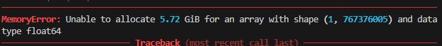

# Reporte del Modelo Final

## Resumen Ejecutivo
- Se evaluaron varios modelos de regresión (LinearRegression, RandomForestRegressor y GradientBoostingRegressor) para el pronóstico de variables anuales de una planta de generación eléctrica (por ejemplo, net_generation_mwh).La evaluación se realizó mediante un test cronológico (hold-out temporal), evitando fuga de información y simulando un escenario real de pronóstico.El GradientBoostingRegressor presentó el mejor desempeño global, con los menores errores absolutos y el R² más cercano a cero, superando tanto al baseline lineal como al Random Forest
. Aunque ninguna aproximación logra un R² positivo en horizontes largos, el modelo seleccionado reduce significativamente el error y ofrece el mejor balance entre precisión y estabilidad temporal.

## Descripción del Problema
- Objetivo: pronosticar indicadores anuales de la planta (generación, factor de capacidad, etc.) a partir del año (`report_year`) y, en modelos no lineales, la tendencia capturada por el ensamble.
- Contexto: series anuales de planta Comanche (u otras) para estimar desempeño futuro; permite comparar escenarios y planificación.
- Justificación: contar con una proyección rápida y replicable sobre datos históricos livianos, evitando la BD completa (14 GB).

## Descripción del Modelo
Modelos evaluados:

- LinearRegression: baseline simple usando únicamente report_year.

- RandomForestRegressor: modelo no lineal basado en ensambles de árboles.

- GradientBoostingRegressor: modelo secuencial que corrige errores previos y captura no linealidades.

- Feature principal: report_year (variable numérica).

- Variable objetivo: columna numérica seleccionable del CSV (excluyendo report_year).

### Metodología:

- División cronológica de los datos (entrenamiento en años históricos, prueba en años futuros).
- Evaluación en horizontes desde 3, según el modelo.
- Comparación directa contra un baseline lineal para validar mejoras reales.

## Evaluación del Modelo
- MAE y RMSE muestran una reducción progresiva del error al aumentar la complejidad del modelo.

- El R² negativo indica que el problema es altamente desafiante a largo plazo; sin embargo, su mejora progresiva confirma una ganancia real frente al baseline.

- El Gradient Boosting logra el mejor compromiso entre precisión, robustez y consumo de recursos.
## Conclusiones y Recomendaciones
- El GradientBoostingRegressor se selecciona como modelo final, al presentar el menor error y mayor estabilidad temporal.
- Los modelos no lineales superan claramente al baseline cuando existen curvaturas o cambios de tendencia en la serie.
- Para series cortas o con alto ruido, los modelos simples siguen siendo útiles como referencia.
- Usar CSVs preprocesados y livianos.
- Evitar cargas superiores a 200 MB mediante el uploader.

- Se intentó realizar un análisis y pronóstico a nivel de condado, pero se presentó un error de memoria insuficiente: el código intentó reservar aproximadamente 5.7 GB de RAM para un arreglo float64 de forma (1, 767,376,005). Con la RAM disponible en Railway (1 GB) no es posible completar esa operación. Esto sugiere que el CSV subido es demasiado grande o que, al transformar/convertir columnas, se está generando un arreglo enorme en memoria.
- 

## Referencias
- Datos de ejemplo: `docs/data/comanche_ferc1_annual.csv` (o CSV subido en app).
